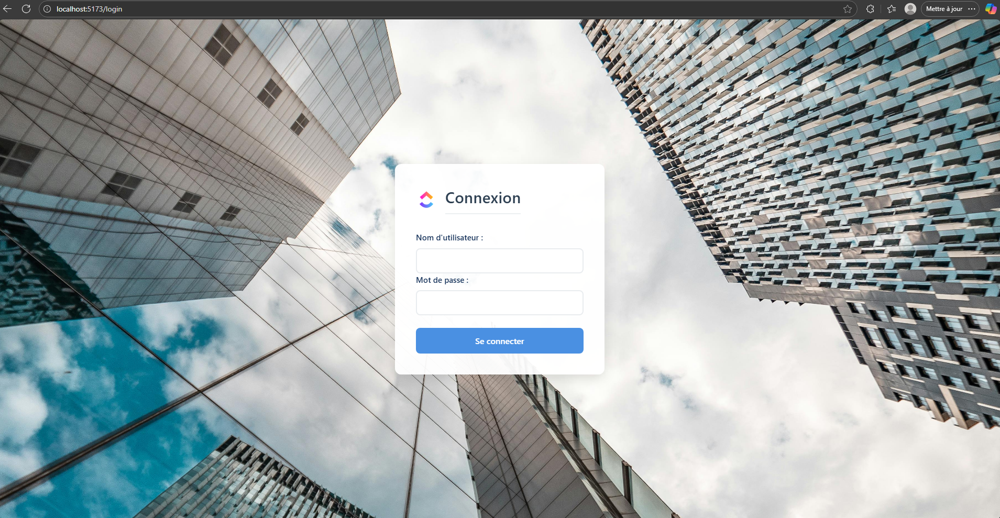
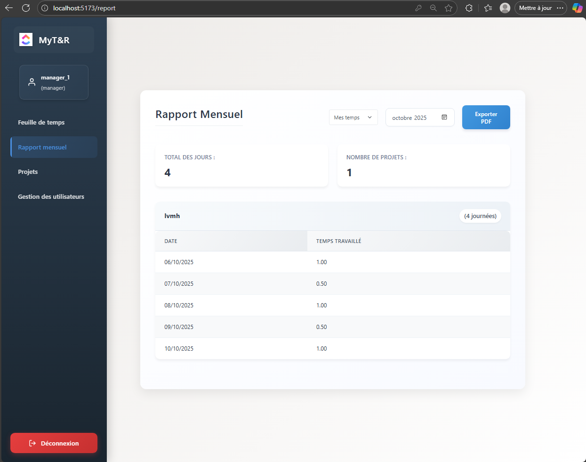
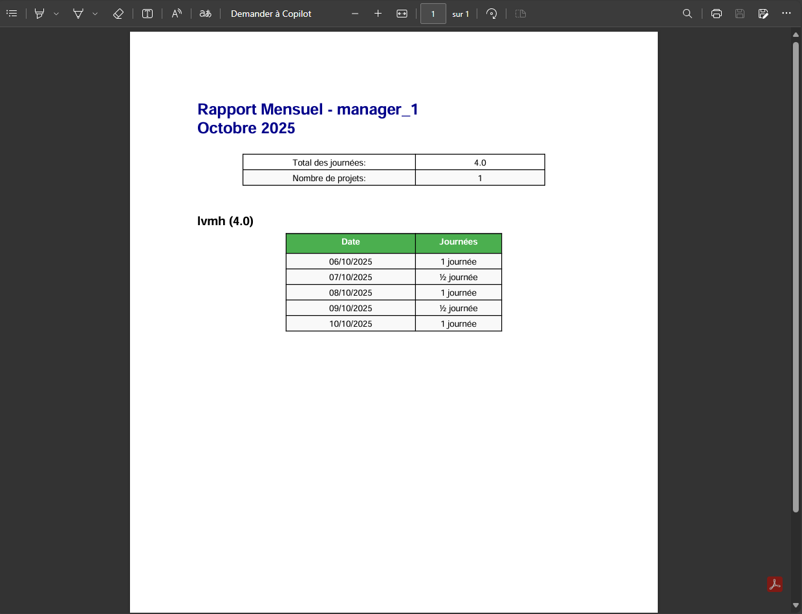
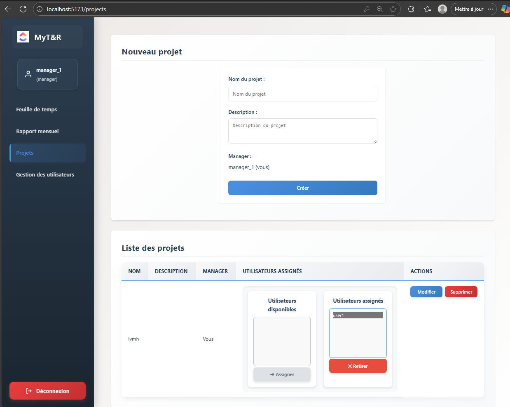
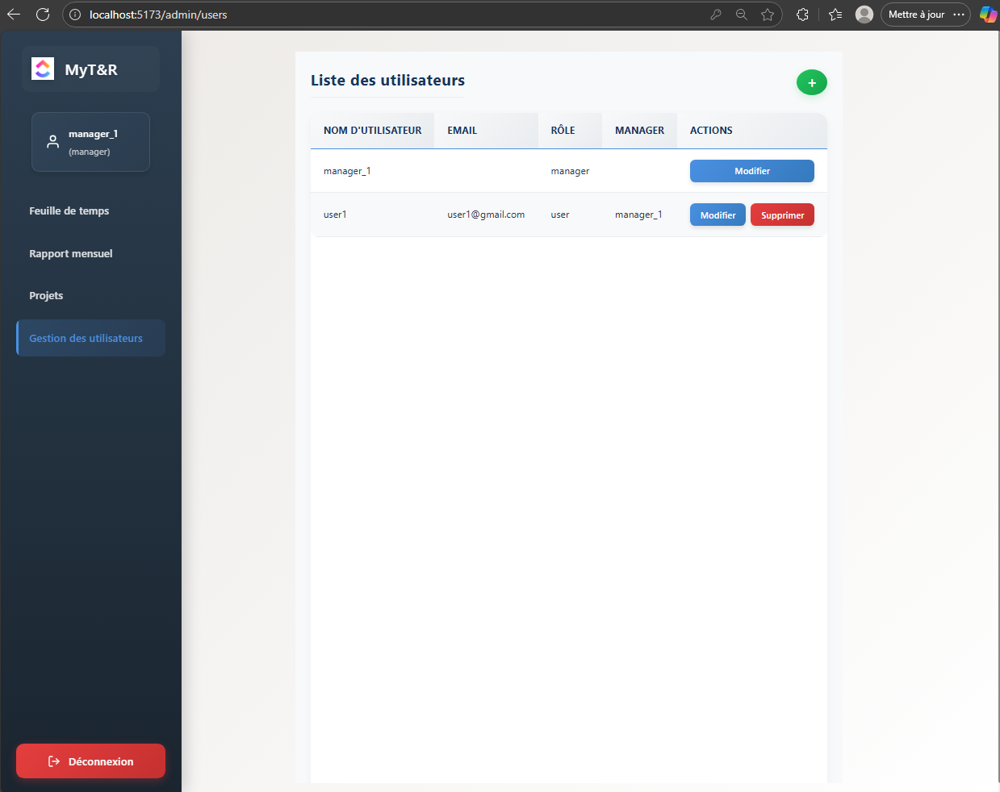

# 🕐 MyT&R - Time Tracking & Reporting Application

<div align="center">
  
  
  ### Professional Time Management Solution
  
  [](https://reactjs.org/)
  [](https://www.typescriptlang.org/)
  [](https://www.djangoproject.com/)
  [](https://www.postgresql.org/)
  [](https://www.docker.com/)
  
</div>

---

## 📋 Overview

**MyT&R** is a comprehensive enterprise-grade time tracking and reporting application designed for organizations with hierarchical team structures. Built with modern technologies, it provides role-based access control, intuitive time entry management, and automated PDF report generation.

### 🎯 Key Features

- **🔐 Role-Based Access Control** - Three-tier permission system (Admin, Manager, User)
- **⏱️ Intuitive Time Entry** - Weekly view with easy time logging per project
- **📊 Automated Reporting** - Monthly PDF reports with detailed breakdowns
- **👥 User Management** - Complete user lifecycle and assignment management
- **📁 Project Management** - Create, assign, and track multiple projects
- **🔄 Real-time Updates** - Instant synchronization across all views
- **📱 Responsive Design** - Works seamlessly on desktop and mobile devices

---

## 🖼️ Application Screenshots

### 🔑 Authentication


*Secure authentication with JWT tokens*

### 📅 Time Entry Dashboard


*Weekly time entry interface with project selection and navigation*

### 📈 Monthly Reports


*Comprehensive monthly reports with project breakdowns and PDF export*

### 📄 PDF Export


* PDF reports generated with ReportLab*

### 📂 Project Management


*Create and manage projects with user assignments*

### 👤 User Administration


*Complete user management with role assignment and manager hierarchy*

---

## 🏗️ Architecture

### Tech Stack

#### Frontend
- **React 18.3** - Modern UI library with hooks
- **TypeScript 5.6** - Type-safe development
- **Vite** - Lightning-fast build tool
- **React Router DOM** - Client-side routing
- **Axios** - HTTP client for API communication
- **React Hook Form** - Efficient form management
- **React Icons** - Comprehensive icon library

#### Backend
- **Django 5.1** - Robust Python web framework
- **Django REST Framework 3.15** - Powerful API toolkit
- **PostgreSQL** - Enterprise-grade database
- **JWT Authentication** - Secure token-based auth
- **ReportLab 4.1** - PDF generation library
- **Gunicorn** - Production WSGI server

#### DevOps
- **Docker & Docker Compose** - Containerized deployment
- **GitLab CI/CD** - Automated testing and deployment
- **CORS Headers** - Secure cross-origin requests

---

## 👥 User Roles & Permissions

### 🔵 User
- ✅ Login with credentials
- ✅ Enter personal time entries
- ✅ View and edit own time entries
- ✅ Generate personal monthly PDF reports

### 🟢 Manager
- ✅ All User permissions
- ✅ View and edit team members' time entries
- ✅ Generate PDF reports for managed users
- ✅ Create, modify, and delete managed projects
- ✅ Assign users to projects

### 🔴 Admin
- ✅ All Manager permissions
- ✅ Assign project managers (from admins/managers)
- ✅ Assign managers to users
- ✅ Change user roles and status
- ✅ Modify user assignments across the organization
- ✅ Full system administration

---

## 🚀 Quick Start

### Prerequisites

- **Docker & Docker Compose** (recommended)
- **Python 3.11+** (for local development)
- **Node.js 18+** (for local development)
- **PostgreSQL 15+** (for local development)

### 🐳 Docker Deployment (Recommended)

```bash
# Clone the repository
git clone <repository-url>
cd time-tracking-app

# Start all services
docker-compose up --build

# Access the application
# Frontend: http://localhost:5173
# Backend API: http://localhost:8000
# Admin Panel: http://localhost:8000/admin
```

### 💻 Local Development Setup

#### Backend Setup

```bash
cd time-tracking-backend

# Create virtual environment
python -m venv venv

# Activate virtual environment
# Windows:
venv\Scripts\activate
# macOS/Linux:
source venv/bin/activate

# Install dependencies
pip install -r requirements.txt

# Run migrations
python manage.py migrate

# Create superuser
python manage.py createsuperuser

# Start development server
python manage.py runserver
```

#### Frontend Setup

```bash
cd time-tracking-frontend

# Install dependencies
npm install

# Start development server
npm run dev
```

---

## 📡 API Documentation

### Base URL
```
http://localhost:8000/api/
```

### Authentication Endpoints

| Method | Endpoint | Description |
|--------|----------|-------------|
| POST | `/api/token/` | Obtain JWT access & refresh tokens |
| POST | `/api/token/refresh/` | Refresh access token |
| POST | `/api/token/verify/` | Verify token validity |

### User Management

| Method | Endpoint | Description |
|--------|----------|-------------|
| GET | `/api/users/` | List all users |
| POST | `/api/users/` | Create new user |
| GET | `/api/users/{id}/` | Get user details |
| PUT/PATCH | `/api/users/{id}/` | Update user |
| DELETE | `/api/users/{id}/` | Delete user |

### Project Management

| Method | Endpoint | Description |
|--------|----------|-------------|
| GET | `/api/projects/` | List all projects |
| POST | `/api/projects/` | Create new project |
| GET | `/api/projects/{id}/` | Get project details |
| PUT/PATCH | `/api/projects/{id}/` | Update project |
| DELETE | `/api/projects/{id}/` | Delete project |

### Time Entries

| Method | Endpoint | Description |
|--------|----------|-------------|
| GET | `/api/time-entries/` | List time entries |
| POST | `/api/time-entries/` | Create time entry |
| GET | `/api/time-entries/{id}/` | Get entry details |
| PUT/PATCH | `/api/time-entries/{id}/` | Update entry |
| DELETE | `/api/time-entries/{id}/` | Delete entry |

### Reports

| Method | Endpoint | Description |
|--------|----------|-------------|
| GET | `/api/reports/monthly/` | Generate monthly report |
| GET | `/api/reports/export-pdf/` | Export report as PDF |

---

## 🗂️ Project Structure

```
time-tracking-app/
├── time-tracking-backend/          # Django REST API
│   ├── api/                        # API application
│   │   ├── models.py              # Database models
│   │   ├── serializers.py         # DRF serializers
│   │   ├── views.py               # API views
│   │   └── urls.py                # API routing
│   ├── back/                       # Project settings
│   │   ├── settings.py            # Django configuration
│   │   └── urls.py                # Main URL configuration
│   ├── requirements.txt            # Python dependencies
│   └── Dockerfile                  # Backend container
│
├── time-tracking-frontend/         # React TypeScript SPA
│   ├── src/
│   │   ├── components/            # React components
│   │   │   ├── Login.tsx          # Authentication
│   │   │   ├── TimeEntryTable.tsx # Time entry interface
│   │   │   ├── MonthlyReport.tsx  # Report generation
│   │   │   ├── ProjectManagement.tsx
│   │   │   └── UserManagement.tsx
│   │   ├── services/              # API integration
│   │   │   └── api.ts             # Axios configuration
│   │   ├── styles/                # CSS modules
│   │   └── types/                 # TypeScript definitions
│   ├── package.json               # Node dependencies
│   └── Dockerfile                 # Frontend container
│
├── docker-compose.yml             # Multi-container orchestration
├── .gitlab-ci.yml                 # CI/CD pipeline
└── README.md                      # This file
```

---

## 🧪 Testing

### Backend Tests
```bash
cd time-tracking-backend
python manage.py test
```

### Frontend Tests
```bash
cd time-tracking-frontend
npm test
```

---

## 🔒 Security Features

- **JWT Authentication** - Secure token-based authentication
- **Password Hashing** - Django's built-in password encryption
- **CORS Protection** - Configured cross-origin resource sharing
- **Role-Based Access Control** - Granular permission system
- **SQL Injection Protection** - Django ORM parameterized queries
- **XSS Prevention** - React's built-in escaping

---

## 🌟 Highlights for Recruiters

### Technical Excellence
- ✅ **Full-Stack Development** - Complete ownership from database to UI
- ✅ **Modern Tech Stack** - Latest versions of React, TypeScript, and Django
- ✅ **Clean Architecture** - Separation of concerns and modular design
- ✅ **Type Safety** - TypeScript for robust frontend development
- ✅ **RESTful API Design** - Industry-standard API architecture
- ✅ **Containerization** - Docker-ready for easy deployment

### Professional Features
- ✅ **Role-Based Access Control** - Enterprise-grade permission system
- ✅ **PDF Generation** - Automated report creation with ReportLab
- ✅ **Responsive Design** - Mobile-first approach
- ✅ **Real-time Updates** - Optimistic UI updates
- ✅ **Form Validation** - Client and server-side validation
- ✅ **Error Handling** - Comprehensive error management

### Best Practices
- ✅ **Git Version Control** - Structured commit history
- ✅ **CI/CD Pipeline** - Automated testing and deployment
- ✅ **Code Organization** - Clear project structure
- ✅ **Documentation** - Comprehensive README and code comments
- ✅ **Testing** - Unit and integration tests
- ✅ **Security First** - Authentication and authorization

---

## 📈 Future Enhancements

- [ ] Email notifications for report generation
- [ ] Advanced analytics dashboard
- [ ] Mobile native applications (React Native)
- [ ] Integration with calendar systems
- [ ] Bulk time entry import/export
- [ ] Multi-language support (i18n)
- [ ] Dark mode theme
- [ ] Real-time collaboration features

---

## 🤝 Contributing

Contributions are welcome! Please follow these guidelines:

1. **Fork** the repository
2. **Create** a feature branch (`git checkout -b feature/AmazingFeature`)
3. **Commit** your changes (`git commit -m 'Add some AmazingFeature'`)
4. **Push** to the branch (`git push origin feature/AmazingFeature`)
5. **Open** a Pull Request

### Code Style
- **Python**: Follow PEP 8 standards
- **TypeScript**: Use ESLint and Prettier configurations
- **Commits**: Follow conventional commits format

---


<div align="center">
  
### ⭐ If you find this project interesting, please consider giving it a star!

**Built with modern technologies for real-world applications**

</div>
